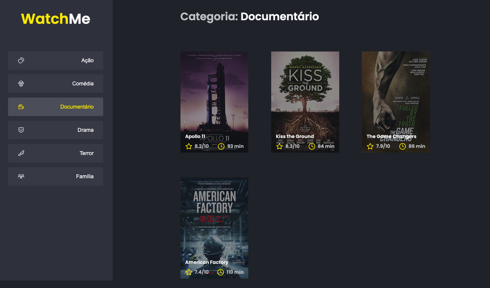

# TODO

<p align="center" >
    
</p>

# Componentizing the application

The project is a SPA for listing movies by genre using React JS and `json-server` to server a fake API.

## The Challange

This will be an application where your main objective is to refactor a page for movie listings according to genre.

- Move the code from `App.tsx` to others components.

## Run the Project

Run the following codes:

```bash
git clone https://github.com/leomiranda/rocketseat-ignite-reactjs-chapter-01-challenge-02.git
cd rocketseat-ignite-reactjs-chapter-01-challenge-02
yarn
yarn server
yarn dev
```

## Results

The `old` structure:

```bash
├── components
│   ├── Button.tsx
│   ├── Icon.tsx
│   └── MovieCard.tsx
├── index.tsx
├── services
│   └── api.ts
└── theme
    ├── button.scss
    ├── content.scss
    ├── global.scss
    ├── movie-card.scss
    └── sidebar.scss
```

The `new` structure:

```bash
├── components
│   ├── commons
│   │   ├── Button
│   │   │   ├── Button.d.ts
│   │   │   ├── Button.scss
│   │   │   ├── Button.tsx
│   │   │   └── index.ts
│   │   ├── Icon
│   │   │   ├── Icon.d.ts
│   │   │   ├── Icon.tsx
│   │   │   └── index.ts
│   │   └── MovieCard
│   │       ├── MovieCard.scss
│   │       ├── MovieCard.tsx
│   │       └── index.ts
│   └── presentation
│       ├── Content
│       │   ├── Content.d.ts
│       │   ├── Content.scss
│       │   ├── Content.tsx
│       │   └── index.ts
│       └── SideBar
│           ├── SideBar.d.ts
│           ├── SideBar.scss
│           ├── SideBar.tsx
│           └── index.ts
├── index.tsx
├── services
│   └── api.ts
└── theme
    ├── Logo
    │   └── index.tsx
    └── styles
        └── global.scss
```
